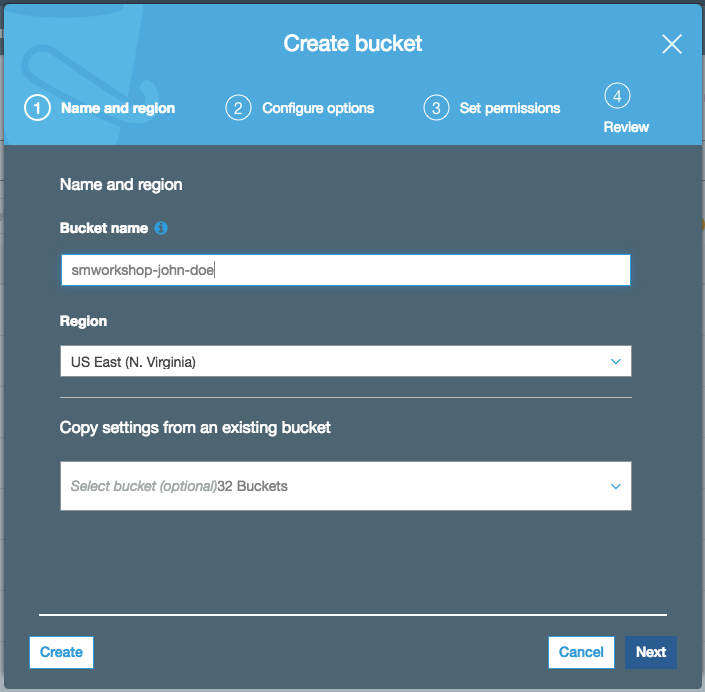
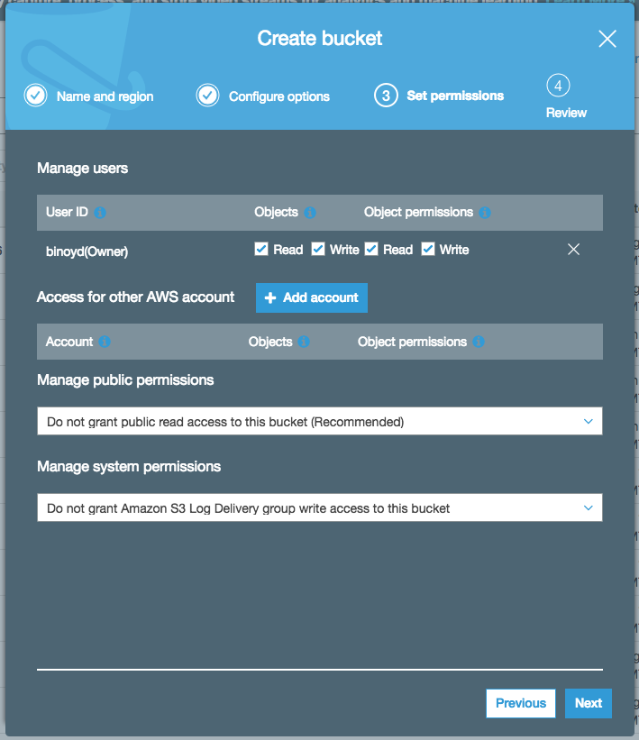
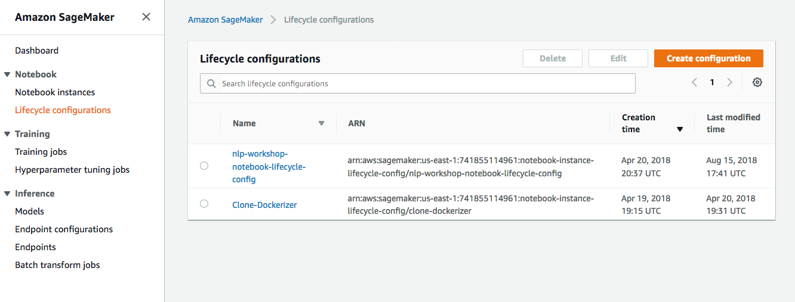
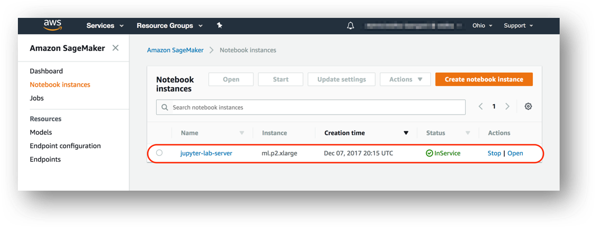
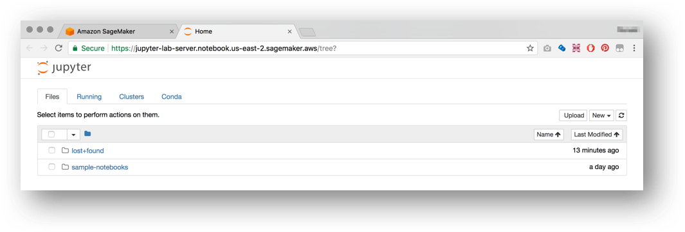

It looks like women like the service better than men, but we are not sure. Unfortunately we did not ask that information from the customer at the time of collecting the information. Is that a dead-end? Maybe not! With ML we can try to predict the gender of the person, using the information we already have. We have the name of the person, and we know that names are more or less gender specific. So, lets try to build a Machine Learning model to help us predict the gender of the person from the name. To do this, we will use the Amazon Sagemaker service.

# Amazon SageMaker

Amazon SageMaker is a fully managed service that enables developers and data scientists to quickly and easily build, train, and deploy machine learning models at any scale. This repository contains a collection of workshops and other hands on content that will guide you through using the many features of SageMaker.  


You'll start by creating a SageMaker notebook instance with the requisite permissions. Depending on the workshop, you will then interact with SageMaker via sample Jupyter notebooks, the AWS CLI, the SageMaker console, or all three. During a workshop, you'll explore various data sets, create model training jobs using SageMaker's hosted training feature, and create endpoints to serve predictions from your models using SageMaker's hosted endpoint feature.  


# Creating required Infrastrucutre

In any machine learning project, you as a data scientist or data engineer would need a compute instance to execute code for various tasks, such as gathering, analyzing, and visualizing data, experimenting with ML model etc. In SageMaker, you would provision this infrastructure in form of Notebook Instance, which will provide you with a cloud hosted Jupyter Notebook, which can access S3 buckets and other resources. You can also use notebooks on this instance to run hosted training deployment, in a programmatic way.

In addition, you'll also need an object storage, in form of an S3 bucket, that you'll use to store data and model artifacts. If you choose to use SageMaker console or corresponding boto3 API, you'd want to specify the location where you store the training data and trained model. In this workshop, the low-level approach requires this, and the S3 bucket you create in following section would be required for that.

If however, you choose to use highlevel SageMaker estimators, as you would if you choose to follow the high-level approach, then SageMaker automatically creates the required bucket. In that case, you can skip through the following Section-1, for creating S3 bucket, and directly jump to Section-2 amd start launching your Notebook in stance.

## 1. Create an S3 Bucket

SageMaker uses S3 as storage for data and model artifacts.  In this step you'll create a S3 bucket for this purpose. To begin, sign into the AWS Management Console, https://console.aws.amazon.com/. You can create a new S3 bucket for the ML training, or use the same S3 bucket. Be warned that the bucket we created in the first module of this workshop might more open permissions than what you need here.

### High-Level Instructions

Use the console or AWS CLI to create an Amazon S3 bucket. Keep in mind that your bucket's name must be globally unique across all regions and customers. We recommend using a name like `smworkshop-firstname-lastname`. If you get an error that your bucket name already exists, try adding additional numbers or characters until you find an unused name.

<details>
<summary><strong>Step-by-step instructions (expand for details)</strong></summary><p>

1. In the AWS Management Console, choose **Services** then select **S3** under Storage.

1. Choose **+Create Bucket**

1. Provide a globally unique name for your bucket such as `smworkshop-firstname-lastname`.

1. Select the Region you've chosen to use for this workshop from the dropdown.

1. Choose **Next** in the lower right of the dialog without selecting a bucket to copy settings from.
    

1. Leave everything default on `Configure options` screen and choose **Next** in the lower right of the dialog.   

1. On `Permissions` screen, esnure that public permissions are not granted to this bucket, by checking that under the dropdown for `Manage public permissions`, the option `Do not grant public read access to this bucket (Recommended)` remains selected. 
    

1. Choose **Next** in the lower right of the dialog to go to Review screen, and verify the screen showed is similar to the example shown below.
    

1. Choose **Create Bucket** to complete the S3 bucket creation. You'll use this bucket to host your training data, and also to store the model artifacts.

</p></details>

## 2. Creating Notebook Lifecycle Configuration

1. Lifecycle configurations are small bootup scripts, that you can use to automate certain tasks when a Notebook instance in being created and/or being started. For this workshop, we'll use a startup script to download pre-built notebooks from this Github repository onto the instances.

2. If following the low level method for model training and hosting, using this script, we'll also download the files required to make our custom container. In addition, in that case, we'll also use the startup script to start Docker service when the notebook instance is being started.

### High-Level Instruction
1. Create a Lifecycle configuration named `workshop-notebook-lifecycle-config` from SageMaker console, with the following script for `Create Notebook`.
```
#!/bin/bash
set -e
git clone https://github.com/aws-samples/aws-nlp-workshop.git
mkdir SageMaker/nlp-workshop
mv aws-nlp-workshop/3_NLPClassifier/container SageMaker/nlp-workshop/container/
mv aws-nlp-workshop/3_NLPClassifier/notebooks SageMaker/nlp-workshop/notebooks/
rm -rf unicornML
sudo chmod -R ugo+w SageMaker/nlp-workshop/
sudo yum install -y docker

```
1. If you decide to follow the high-level approach for model training and hosting, in the script above, the lines to move `container` folder, and the line to install Docker are not needed.

1. If you decide to follow low-level approach for model training and hosting, in the same Lifecycle configuration, also add the following script for `Start notebook`.

```
#!/bin/bash
set -e
sudo service docker start

```

## 3. Launching the Notebook Instance

1. In the upper-right corner of the AWS Management Console, confirm you are in the desired AWS region. Select N. Virginia, Oregon, Ohio, or Ireland.

2. Click on Amazon SageMaker from the list of all services.  This will bring you to the Amazon SageMaker console homepage.


3. Before you create a notebook instance, we want to create a "Lifecycle configuration". This is a small bootstrap script that will be run on the Notebook as soon as it starts. We will use this mechanism to download all the relevant notebook files.



In this, enter the following script.

```
#!/bin/bash
set -e
git clone https://github.com/aws-samples/aws-nlp-workshop.git
mkdir SageMaker/nlp-workshop
mv aws-nlp-workshop/3_NLPClassifier/container SageMaker/nlp-workshop/container/
mv aws-nlp-workshop/3_NLPClassifier/notebooks SageMaker/nlp-workshop/notebooks/
rm -rf unicornML
sudo chmod -R ugo+w SageMaker/nlp-workshop/
sudo yum install -y docker
sudo service docker start

```


4. To create a new notebook instance, go to **Notebook instances**, and click the **Create notebook instance** button at the top of the browser window.


5. Type smworkshop-[First Name]-[Last Name] into the **Notebook instance name** text box, and select ml.m4.xlarge for the **Notebook instance type**.


6. For IAM role, choose **Create a new role**, and in the resulting pop-up modal, select **Specific S3 buckets** under **S3 Buckets you specify – optional**. In the text field, paste the name of the S3 bucket you created above, AND the following bucket name separated from the first by a comma:  `gdelt-open-data`.  The combined field entry should look similar to ```smworkshop-john-smith, gdelt-open-data```. Click **Create role**.


7. You will be taken back to the Create Notebook instance page.  Click **Create notebook instance**.

### 4. Accessing the Notebook Instance

1. Wait for the server status to change to **InService**. This will take several minutes, possibly up to ten but likely less.



2. Click **Open**. You will now see the Jupyter homepage for your notebook instance.



### 5. Model Training and Hosting

1. Now, you are going to build a machine learning model on SageMaker. We have created two methods, the first method uses "High-Level Sagemaker APIs" which abstracts away some part of the packaging steps.

   The second method called "Low level API method" which takes you through the lower level APIs, including the steps to create your own docker image to deploy the Keras model.

2. Both methods require a minimum of 30mins to run. Choose one method to proceed.

    <details>
    <summary><strong>High - Level Sagemaker API Method (expand for details)</strong></summary><p>

    Once you open the notebook, you will see a file browser. Browse to the folder called "nlp-workshop/notebooks/". Click on the "highlevel-tensorflow-classifer.ipynb" file to open the Jypyter notebook. The remaining instructions to run the notebook are embeddeded in the notebook itself.

    After successfully creating an endpoint, the next step would be to create a new API Gateway method, a Lambda function in the backend to integrate with the hosted endpoint, and update the configuration Javsacript of your webapplication so that when `Identify Gender` button is clicked, this new endpoint recieved the HTTP request. If you're eager to see the end result of all the hard work you put in to identify customers' genders, you can launch one of these AWS CloudFormation templates in the Region of your choice to build the necessary resources automatically.

    Region| Launch
    ------|-----
    US East (N. Virginia) | [](https://console.aws.amazon.com/cloudformation/home?region=us-east-1#/stacks/new?stackName=nlp-workshop-voc-sagemaker&templateURL=https://s3.amazonaws.com/nlp-serverless-workshop/voc-sagemaker-high-level.json)
    US East (Ohio) | [](https://console.aws.amazon.com/cloudformation/home?region=us-east-2#/stacks/new?stackName=nlp-workshop-voc-sagemaker&templateURL=https://s3.amazonaws.com/nlp-serverless-workshop/voc-sagemaker-high-level.json)
    US West (Oregon) | [](https://console.aws.amazon.com/cloudformation/home?region=us-west-2#/stacks/new?stackName=nlp-workshop-voc-sagemaker&templateURL=https://s3.amazonaws.com/nlp-serverless-workshop/voc-sagemaker-high-level.json)
    EU (Ireland) | [](https://console.aws.amazon.com/cloudformation/home?region=eu-west-1#/stacks/new?stackName=nlp-workshop-voc-sagemaker&templateURL=https://s3.amazonaws.com/nlp-serverless-workshop/voc-sagemaker-high-level.json)

    </details>

    <details>
    <summary><strong>Low - level Sagemaker API using Docker - method (expand for details)</strong></summary><p>

    Once you finish Running the orchestration notebook, and obtain a SageMaker hosted endpoint name, the next step would be to create a new API Gateway method, a Lambda function in the backend to integrate with the hosted endpoint, and update the configuration Javsacript of your webapplication so that when `Identify Gender` button is clicked, this new endpoint recieved the HTTP request. If you're eager to see the end result of all the hard work you put in to identify customers' genders,  you can launch one of these AWS CloudFormation templates in the Region of your choice to build the necessary resources
    automatically.

    Region| Launch
    ------|-----
    US East (N. Virginia) | [](https://console.aws.amazon.com/cloudformation/home?region=us-east-1#/stacks/new?stackName=nlp-workshop-voc-sagemaker&templateURL=https://s3.amazonaws.com/nlp-serverless-workshop/templates/voc-sagemaker.json)
    US East (Ohio) | [](https://console.aws.amazon.com/cloudformation/home?region=us-east-2#/stacks/new?stackName=nlp-workshop-voc-sagemaker&templateURL=https://s3.amazonaws.com/nlp-serverless-workshop/templates/voc-sagemaker.json)
    US West (Oregon) | [](https://console.aws.amazon.com/cloudformation/home?region=us-west-2#/stacks/new?stackName=nlp-workshop-voc-sagemaker&templateURL=https://s3.amazonaws.com/nlp-serverless-workshop/templates/voc-sagemaker.json)
    EU (Ireland) | [](https://console.aws.amazon.com/cloudformation/home?region=eu-west-1#/stacks/new?stackName=nlp-workshop-voc-sagemaker&templateURL=https://s3.amazonaws.com/nlp-serverless-workshop/templates/voc-sagemaker.json)
    </details>


3. Now you will be able to make predictions about the gender of the customer from the first name. Try to see if you can increase the accuracy of your predictions.
